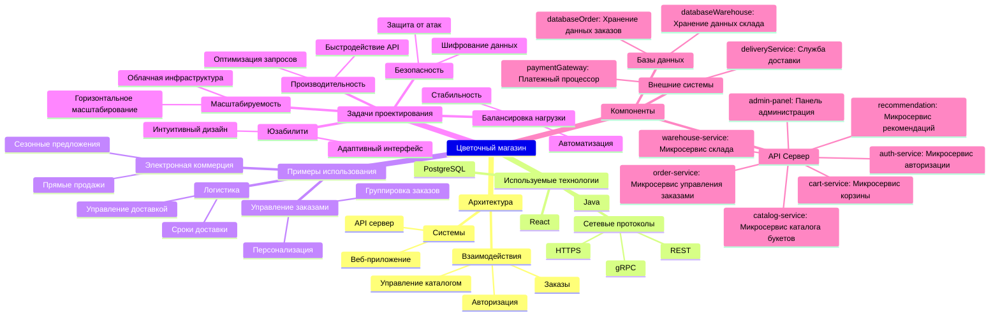
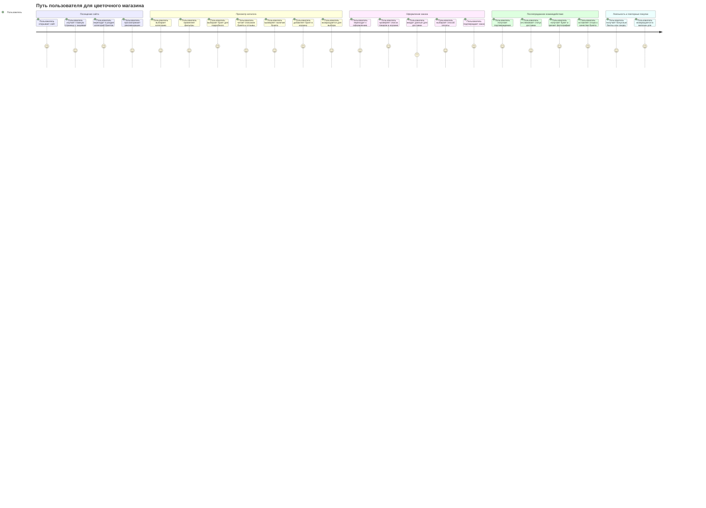
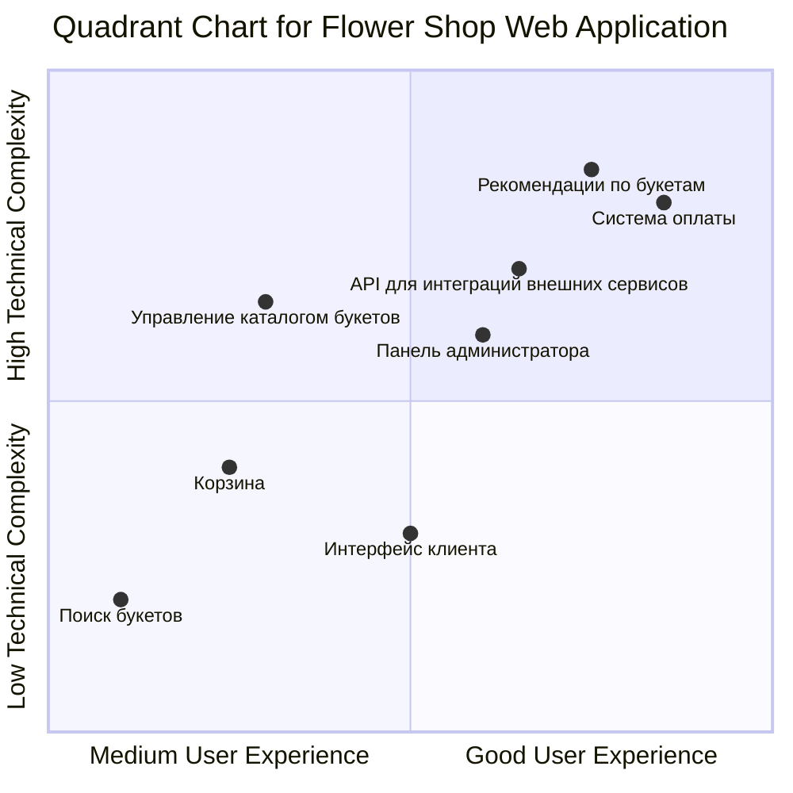
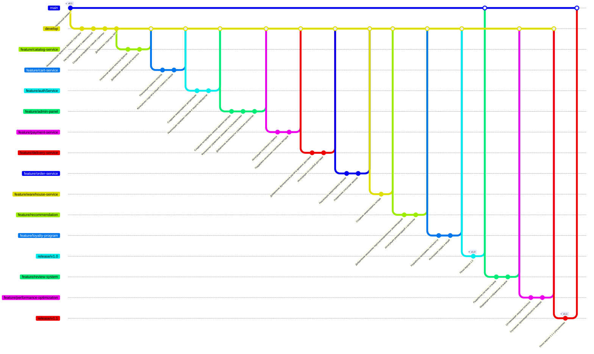

# Диаграмма Mindmap для цветочного магазина

# Описание для mindmap в Markdown-стиле:

### Цветочный магазин

Цветочный магазин представляет собой высокотехнологичное веб-приложение, спроектированное для удобной и эффективной работы с заказами на букеты. Основные аспекты системы включают архитектуру, используемые технологии, примеры применения, задачи проектирования и ключевые компоненты.

---

### Архитектура
- **Системы**:
  - **API сервер**: Центральный компонент, который обрабатывает запросы клиентов, управляет данными и взаимодействует с базой данных.
  - **Веб-приложение**: Клиентский интерфейс для пользователей, предоставляющий возможность оформления заказов, работы с корзиной и просмотра каталога.
- **Взаимодействия**:
  - **Авторизация**: Регистрация и вход в систему для безопасного доступа.
  - **Заказы**: Создание, управление и отслеживание заказов.
  - **Управление каталогом**: Добавление, редактирование и удаление товаров, а также управление категориями и настройка фильтров для удобного использования.
---

### Используемые технологии
- **Frontend**:
  - *React*: Создание адаптивного и интерактивного пользовательского интерфейса.
- **Backend**:
  - *Java*: Основной язык для написания серверной части.
  - *PostgreSQL*: Реляционная база данных для надежного хранения информации.
- **Сетевые протоколы**:
  - *HTTPS*: Защита данных в процессе передачи.
  - *REST*: Эффективное взаимодействие между клиентом и сервером.
  - *gRPC*: Высокопроизводительная связь между микросервисами.

---

### Примеры использования
- **Электронная коммерция**:
  - **Прямые продажи**: Возможность заказа букетов через веб-приложение.
  - **Сезонные предложения**: Управление скидками и акциями для пользователей.
- **Логистика**:
  - **Управление доставкой**: Интеграция со службами доставки для автоматизации процесса.
  - **Сроки доставки**: Учет времени выполнения заказов.
- **Управление заказами**:
  - **Группировка заказов**: Упрощение обработки больших объемов.
  - **Персонализация**: Адаптация предложений под каждого клиента.

---

### Задачи проектирования
- **Масштабируемость**:
  - Горизонтальное масштабирование через облачные технологии.
  - Увеличение нагрузки без снижения производительности.
- **Балансировка нагрузки**:
  - Использование автоматизированных систем для равномерного распределения запросов.
  - Обеспечение стабильности работы приложения.
- **Безопасность**:
  - Шифрование всех данных пользователей.
  - Защита от атак, включая DDoS.
- **Производительность**:
  - Быстродействие API за счет оптимизации кода и запросов.
  - Снижение времени отклика сервера.
- **Юзабилити**:
  - Интуитивный дизайн для новых пользователей.
  - Адаптивный интерфейс, подходящий для различных устройств.

---

### Компоненты
- **API Сервер**:
  - *auth-service*: Управление учетными записями и безопасностью.
  - *order-service*: Создание, обновление и обработка заказов.
  - *cart-service*: Управление корзиной пользователей.
  - *catalog-service*: Обеспечение работы каталога с букетами.
  - *recommendation*: Персонализированные рекомендации для клиентов.
  - *warehouse-service*: Управление данными о доступности товаров на складе.
  - *admin-panel*: Инструменты для администраторов.
- **Базы данных**:
  - *databaseOrder*: Хранение информации о заказах.
  - *databaseWarehouse*: Учет запасов товаров.
- **Внешние системы**:
  - *paymentGateway*: Обработка платежей через сторонние сервисы.
  - *deliveryService*: Интеграция с курьерскими службами для автоматизации доставки.

# Диаграмма User Journey для цветочного магазина

### Описание пути пользователя для цветочного магазина

Диаграмма иллюстрирует полный цикл взаимодействия пользователя с веб-приложением цветочного магазина, начиная с посещения сайта и заканчивая повторными покупками благодаря программе лояльности.

---

#### *Посещение сайта:*  
- Пользователь открывает сайт, видя предложения и акционные предложения.  
- Пользователь изучает главную страницу и переходит в раздел категорий букетов.  
- Просматривает персонализированные рекомендации на основе своих предпочтений или трендов.

---

#### *Просмотр каталога:*  
- Пользователь выбирает подходящую категорию, например, "Праздничные букеты".  
- Применяет фильтры для уточнения поиска (по цене, цвету, типу цветов).  
- Выбирает понравившийся букет для подробного просмотра.  
- Читает описание, смотрит фотографии и отзывы других клиентов.  
- Проверяет наличие выбранного букета в магазине.  
- Добавляет букет в корзину.  
- Возвращается к каталогу для выбора дополнительных аксессуаров, таких как открытки или упаковка.

---

#### *Оформление заказа:*  
- Переходит к оформлению заказа и проверяет содержимое корзины.  
- Вводит данные для доставки, такие как адрес и желаемое время.  
- Выбирает способ оплаты (карта, онлайн-кошелек, оплата при доставке).  
- Подтверждает заказ после проверки всех данных.  

---

#### *Послепродажное взаимодействие:*  
- Получает подтверждение заказа.  
- Отслеживает статус доставки.  
- Получает букет.  
- Делает фотографии полученного букета и оставляет отзыв о качестве букета и обслуживании.  

---

#### *Лояльность и повторные покупки:*  
- Получает бонусные баллы или скидку на следующую покупку.  
- Сохраняет понравившиеся букеты в избранное для будущих покупок.  
- Возвращается в магазин, довольный качеством товаров и услуг, и оформляет новую покупку.  

# Квадрант-граф

# Оси квадранта

**Ось X: От среднего к отличному пользовательскому опыту**  
Эта ось демонстрирует уровень удобства и интуитивности пользовательского интерфейса. На нижнем уровне расположены элементы, которые могут вызывать сложности у пользователя, требуя большего времени или усилий. На верхнем уровне находятся компоненты с продуманным, приятным и интуитивно понятным интерфейсом, облегчающим взаимодействие.

**Ось Y: От простой к сложной технической реализации**  
Эта ось показывает степень сложности разработки. Низкая сложность означает, что компонент легко реализовать с минимальными усилиями и затратами. Высокая сложность связана с применением продвинутых технологий, значительных ресурсов и временных затрат.

# Элементы квадранта

#### **Поиск букетов: [0.1, 0.2]**  
- **Пользовательский опыт:** Низкий — поиск может быть недостаточно удобным, что усложняет нахождение нужного букета.  
- **Техническая сложность:** Очень низкая — реализация базового поиска с простыми фильтрами и сортировкой не требует значительных усилий.  

#### **Корзина: [0.25, 0.4]**  
- **Пользовательский опыт:** Средний — интерфейс корзины интуитивен, но возможны улучшения для упрощения управления заказами.  
- **Техническая сложность:** Низкая — добавление базовых функций управления товарами в корзине не требует сложных технологий, однако может потребовать интеграции с платежной системой.  

#### **Интерфейс клиента: [0.5, 0.3]**  
- **Пользовательский опыт:** Средний — интерфейс достаточно понятный, но могут быть трудности с навигацией для новых пользователей.  
- **Техническая сложность:** Низкая до средней — создание удобного пользовательского интерфейса требует дизайна и взаимодействия с API, но это не самая сложная задача.  

#### **Рекомендации по букетам: [0.75, 0.85]**  
- **Пользовательский опыт:** Высокий — персонализированные рекомендации значительно улучшают взаимодействие, предлагая букеты на основе предпочтений клиента.  
- **Техническая сложность:** Высокая — система рекомендаций требует применения алгоритмов машинного обучения или аналитики, что делает её сложной для реализации.  

#### **Система оплаты: [0.85, 0.8]**  
- **Пользовательский опыт:** Очень высокий — удобство и безопасность оплаты улучшают доверие пользователей и их готовность завершить покупку.  
- **Техническая сложность:** Высокая — требуется интеграция с различными платёжными системами и обеспечение высокого уровня безопасности транзакций.  

#### **API для интеграций внешних сервисов: [0.65, 0.7]**  
- **Пользовательский опыт:** Средний — влияние на пользователя минимальное, так как компонент используется для работы с внешними системами.  
- **Техническая сложность:** Средняя — создание надёжного API для взаимодействия с внешними сервисами требует планирования и опыта работы с сетевыми протоколами.  

#### **Административная панель: [0.6, 0.6]**  
- **Пользовательский опыт:** Средний — администраторам может быть сложно освоить панель без дополнительных инструкций, но базовый функционал понятен.  
- **Техническая сложность:** Средняя — разработка интерфейса для управления заказами, пользователями и каталогом требует интеграции с базой данных и API.  

#### **Управление каталогом букетов: [0.3, 0.65]**  
- **Пользовательский опыт:** Средний — администраторы могут эффективно управлять каталогом, однако улучшения фильтров и сортировки могут повысить удобство.  
- **Техническая сложность:** Средняя — добавление, обновление и удаление информации о букетах требует надежного взаимодействия с базой данных и интерфейсом для администратора.

# Гит граф

# Описание Git графа для разработки веб-приложения цветочного магазина

Этот Git граф иллюстрирует поэтапный процесс создания веб-приложения для цветочного магазина, охватывая разработку ключевых функциональных модулей и микросервисов. Каждый коммит отражает значимый этап, начиная с подготовки базовой инфраструктуры проекта и завершая выпуском готового продукта с полноценным набором функций.

## Этапы разработки

### 1. Начальный коммит  
Процесс начинается с создания основной структуры проекта, добавления базовых файлов и настроек для работы. Этот этап закладывает основу для всех дальнейших разработок.

### 2. Инициализация проекта и настройка окружения  
На этом этапе устанавливаются все необходимые зависимости и компоненты для разработки, включая подключение серверных и клиентских модулей.

### 3. Создание интерфейса главной страницы  
Реализуется основная страница веб-приложения, которая включает базовый дизайн и элементы навигации для удобного взаимодействия с пользователем.

### 4. Добавление структуры API  
Определяются основные эндпоинты API, которые будут использоваться для связи между фронтендом и бэкендом, а также создаются маршруты для обработки запросов.

### 5. Реализация каталога букетов  
На этом этапе разрабатывается функциональность каталога, где пользователи могут просматривать доступные букеты. Этот компонент включает в себя базовые возможности, такие как отображение товаров с описаниями и фотографиями.

### 6. Добавление фильтров для каталога  
Интегрируются функции фильтрации и сортировки букетов, что позволяет пользователям находить подходящие варианты быстрее и удобнее.

### 7. Реализация корзины покупок  
Создается корзина покупок, где пользователи могут добавлять выбранные букеты, изменять их количество и просматривать общую стоимость заказа.

### 8. Функционал подсчёта общей стоимости заказа  
Добавляется автоматический расчет итоговой стоимости заказа, включая учёт доставки, скидок и акций.

### 9. Создание микросервиса авторизации
Микросервис авторизации обрабатывает регистрацию, вход в систему и защиту маршрутов. На этом этапе добавляется базовая безопасность для пользователей.

### 10. Проверка токенов и защита маршрутов  
Внедряется проверка токенов для аутентификации пользователей, что обеспечивает защиту приватных маршрутов.

### 11. Разработка панели администратора  
Создается административная панель для управления заказами, пользователями и каталогом букетов.

### 12. Управление заказами и пользователями  
Администраторы получают инструменты для просмотра и изменения заказов, а также управления учетными записями клиентов.

### 13. Управление каталогом букетов  
Добавляется возможность для администраторов добавлять, удалять и редактировать информацию о букетах.

### 14. Интеграция платёжного сервиса  
Подключается внешний платёжный сервис, обеспечивающий безопасную обработку транзакций.

### 15. Поддержка нескольких платёжных методов  
Реализуются различные способы оплаты, такие как банковские карты и электронные кошельки, чтобы удовлетворить потребности всех пользователей.

### 16. Функционал расчёта времени доставки  
Добавляется расчет времени доставки в зависимости от местоположения пользователя и загруженности курьерской службы.

### 17. Интеграция со службой доставки  
Подключается внешняя курьерская служба для автоматизации доставки заказов, включая отслеживание их статусов.

### 18. Создание микросервиса заказов 
Этот микросервис управляет созданием, обновлением и статусами заказов в системе.

### 19. Реализация микросервиса склада
Микросервис обеспечивает управление запасами цветов и материалов на складе, синхронизируя данные с каталогом и заказами.

### 20. Разработка механизма рекомендаций  
Создается система рекомендаций, предлагающая пользователям букеты на основе их предпочтений и истории заказов.

### 21. Интеграция рекомендаций с каталогом  
Система рекомендаций интегрируется в каталог, предоставляя персонализированные предложения прямо на страницах товаров.

### 22. Разработка программы лояльности  
Создается система накопительных баллов, скидок и акций, направленных на удержание клиентов и стимулирование повторных покупок.

### 23. Интеграция скидок и акций  
Добавляется функциональность применения купонов, промоакций и персонализированных предложений.

### 24. Релиз версии 1.0  
Первый релиз включает в себя основные функции, такие как каталог букетов, корзина, платежи, доставка и панель администратора.

### 25. Разработка системы отзывов  
Добавляется возможность для клиентов оставлять отзывы о букетах, улучшая взаимодействие с пользователями и доверие к магазину.

### 26. Модерация и отображение отзывов  
Отзывы проходят модерацию перед публикацией, а затем отображаются на страницах товаров.

### 27. Оптимизация загрузки каталога  
Проводится работа по улучшению времени загрузки страниц каталога, включая кэширование данных и оптимизацию изображений.

### 28. Улучшение производительности сервера  
Оптимизируются запросы к базе данных, добавляются механизмы масштабирования и балансировки нагрузки.

### 29. Релиз версии 1.1  
После оптимизации и добавления новых функций выходит обновленная версия приложения с улучшенной производительностью и интерфейсом.  
